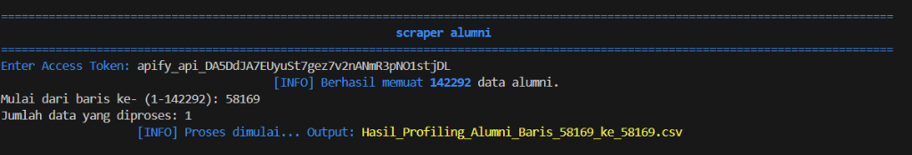
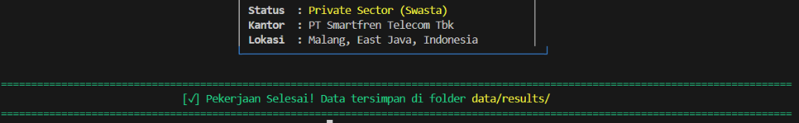

#  Alumni Profiling Scraper

Alat penambangan data (*data mining*) tingkat profesional yang dirancang untuk mencari, mengidentifikasi, dan mengategorikan alumni **Universitas Muhammadiyah Malang (UMM)** dari LinkedIn menggunakan Apify API.

---

##  Fitur Utama
- **Arsitektur OOP Modular**: Dibangun dengan struktur yang rapi dan terpisah (*decoupled*) untuk pemeliharaan kode yang mudah.
- **CLI Rata Tengah Dinamis**: Antarmuka terminal yang estetik dengan posisi teks rata tengah otomatis menyesuaikan lebar jendela.
- **Klasifikasi Sektor Cerdas**: Mengategorikan alumni secara otomatis ke dalam sektor seperti **BUMN, PNS, Pendidikan, Wirausaha, dan Swasta**.
- **Filter Alumni UMM**: Logika tingkat lanjut untuk memfilter profil yang secara spesifik mencantumkan UMM di bagian pendidikan atau ringkasan.
- **Penanganan Error yang Tangguh**: Mampu menangani limit kredit API dan input yang tidak valid tanpa membuat program berhenti (*crash*).
- **Intelijen Riwayat Kerja**: Mendeteksi status "Resign" dan membedakan antara pekerjaan saat ini (*present*) dan pekerjaan sebelumnya.

---

##  Struktur Proyek
```text
scracp/
├── core/
│   ├── engine.py       # Me
│   └── processor.py    # Logika pemecahan nama & klasifikasi sektor
├── utils/nangani komunikasi dengan Apify API
│   └── interface.py    # UI Terminal dengan warna ANSI & rata tengah
├── data/
│   ├── source/         # Letakkan file 'alumni_data.xlsx' di sini
│   └── results/        # Hasil CSV akan tersimpan otomatis di sini
├── main.py             # Titik masuk utama aplikasi
└── README.md           # Dokumentasi proyek
```

---

##  Instalasi & Persiapan

### 1. Prasyarat
- **Python 3.10+** sudah terinstal di sistem Anda.
- **Akun Apify**: Anda memerlukan [Apify API Token](https://console.apify.com/account#/integrations).

### 2. Instalasi Library
Jalankan perintah berikut di terminal Anda:
```bash
pip install pandas openpyxl apify-client
```

### 3. Persiapan Data
Letakkan file Excel sumber Anda di `data/source/alumni_data.xlsx`. Pastikan memiliki kolom bernama `Nama Lulusan`.

---

##  Cara Penggunaan

1.  **Jalankan Skrip**:
    ```bash
    python main.py
    ```
    

2.  **Masukkan API Token**: Tempelkan Token API Apify Anda saat diminta.
3.  **Atur Rentang Proses**: 
    - Masukkan nomor baris mulai (contoh: `1`).
    - Masukkan jumlah data yang ingin diproses (contoh: `50`).
4.  **Lihat Hasil**: Setelah selesai, cek folder `data/results/` untuk melihat file CSV yang dihasilkan.
    

---

##  Pemetaan Hasil
File CSV hasil akan berisi informasi detail meliputi:
- **Identitas**: Nama, NIM, Prodi, Fakultas.
- **Kontak**: URL LinkedIn, Email (jika publik).
- **Pekerjaan (Saat Ini)**: Nama Perusahaan, Posisi, Sektor, Sosmed Kantor.
- **Pekerjaan (Terakhir)**: Perusahaan Sebelumnya, Jabatan Terakhir, Tahun Resign.
- **Alamat**: Teks lokasi yang sudah dibersihkan dari LinkedIn.

---

##  Detail Konfigurasi
- **Universitas Target**: `muhammadiyah malang` (Terintegrasi di `main.py`).
- **Mode Scraper**: Mode pencarian profil lengkap + email.
- **Klasifikasi**: Kata kunci untuk BUMN, PNS, dll. dapat disesuaikan di `core/processor.py`.

---

##  Disclaimer
Alat ini dibuat untuk tujuan pendidikan dan penelitian. 